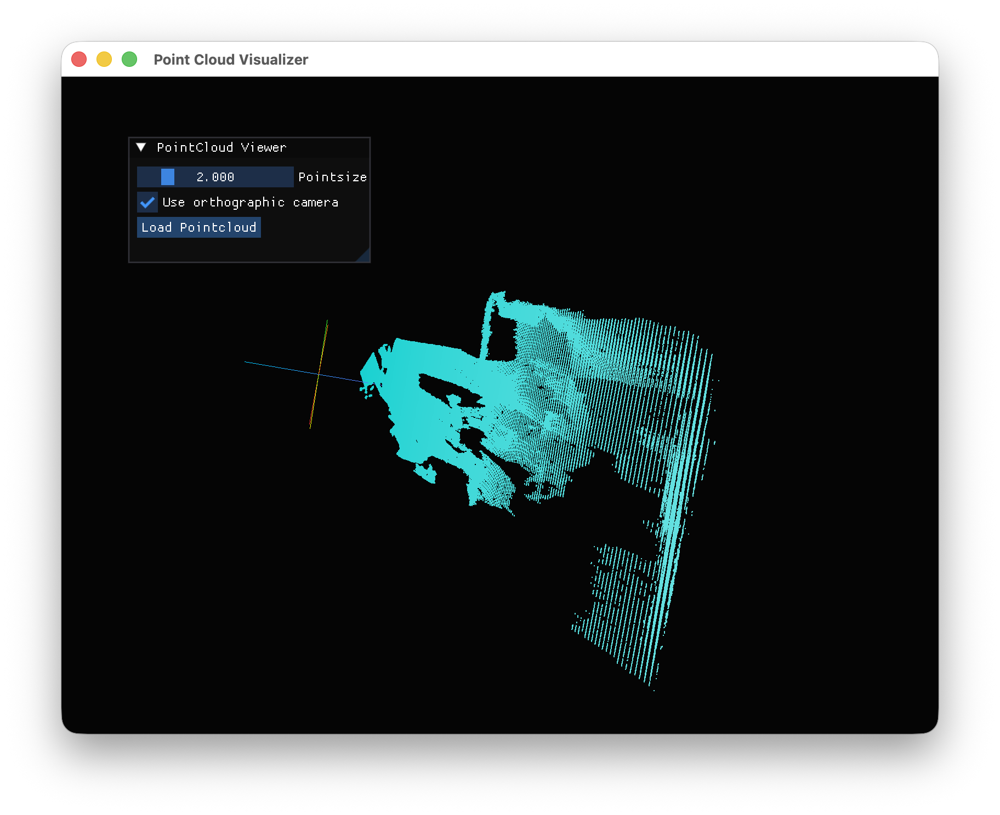

# Visin — Real-time 3D Point Cloud Visualizer

Visin is a desktop application for visualizing 3D point cloud data (e.g., from LiDAR scans). It renders point clouds with height-based coloring and provides interactive camera controls for exploration.



## Features

- **Interactive 3D viewport** — orbit (left-drag), pan (right-drag), zoom (scroll), WASD fly-through
- **Height-based coloring** — underground points in brown, ground in green, above-ground in a cyan-to-white gradient
- **Perspective & orthographic** projection modes (toggle with `P` or the UI checkbox)
- **Supported formats:** PCD, PLY, XYZ, CSV, ASC, TXT, PTS
- **Dear ImGui UI panel** with point size slider and point cloud file loader
- **Batch loading** — select multiple files to merge their point clouds

## Requirements

- Python 3
- GLFW (system library, installed via e.g. `brew install glfw` on macOS)

## Installation

```bash
pip install -r requirements.txt
```

Optional dependencies:
- `pypcd4` — PCD file support
- `plyfile` — PLY file support

## Usage

```bash
python main.py
```

Click **Load Pointcloud** in the UI panel to open a file dialog. Supported formats are auto-detected from the file extension.

### Controls

| Input | Action |
|---|---|
| Left-click drag | Orbit camera |
| Right-click drag | Pan camera |
| Shift + left-click drag | Pan camera |
| Scroll wheel | Zoom in/out |
| W / S | Move forward/backward |
| A / D | Move left/right |
| P | Toggle perspective/orthographic |
| Escape | Exit |

## Tests

```bash
python -m unittest discover tests
```

## Project Structure

```
visin/
├── main.py                     # Entry point
├── visin/
│   ├── app/visualizer.py       # GLFW window, ImGui render loop, event handling
│   ├── core/
│   │   ├── camera.py           # Camera & CameraController (orbit, pan, zoom)
│   │   ├── math.py             # Matrix utilities (lookAt, projection, etc.)
│   │   └── pointcloud_io.py    # Point cloud file readers (PCD, PLY, text)
│   └── render/
│       ├── pointcloud_renderer.py  # ModernGL point cloud renderer
│       └── lines_renderer.py       # ModernGL axis-marker renderer
└── tests/
    └── test_pointcloud_io.py   # Unit tests for point cloud I/O
```
